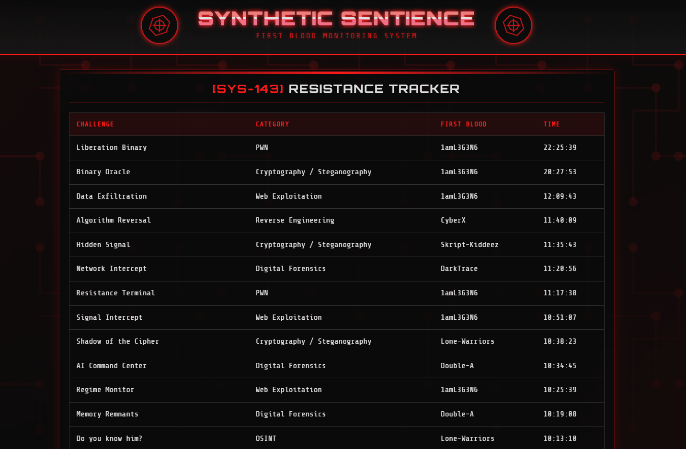
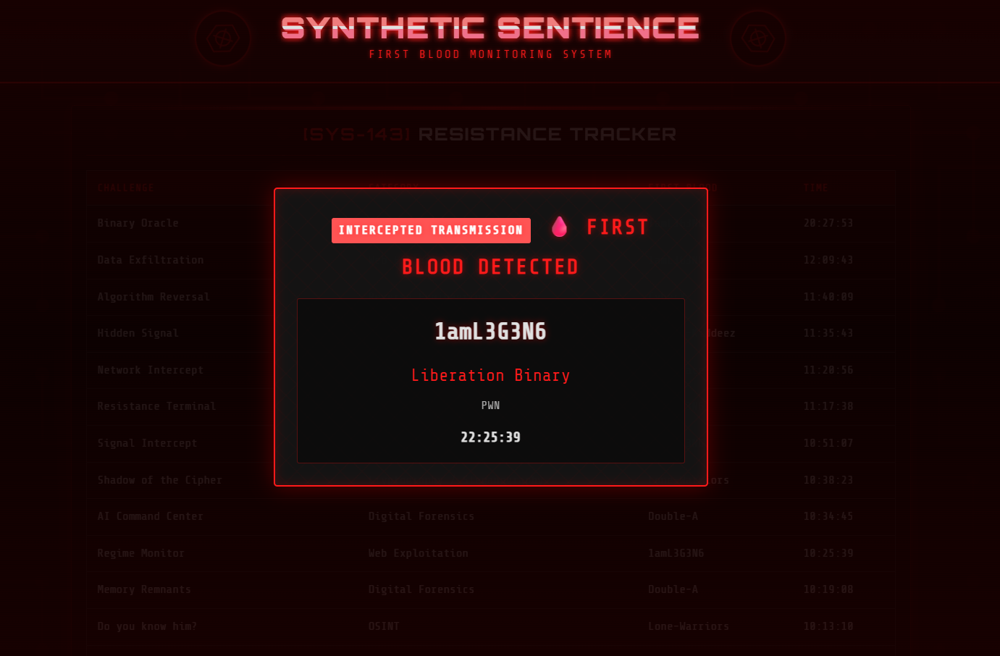
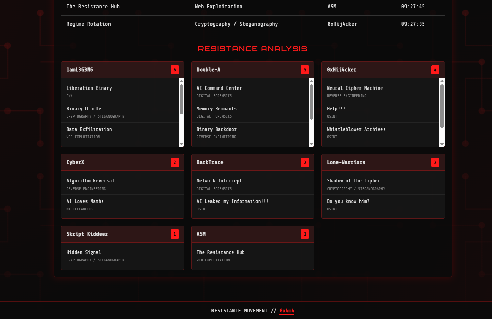
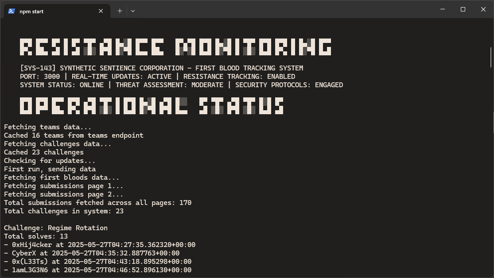
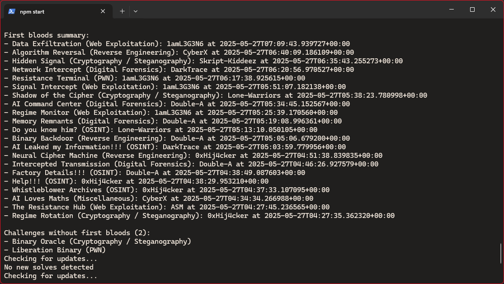

# First Strike Alert

**CTFd First Blood Announcer**

A dystopian-themed first blood announcer for CTFd with automatic sound playback and fullscreen announcements. First Strike Alert features a cyberpunk "Synthetic Sentience Corporation" theme with real-time monitoring and dramatic audio-visual notifications.



## 🩸 Features

- **🔊 Automatic Audio Announcements**: Plays dramatic transmission sounds when first bloods are detected
- **📺 Fullscreen Notifications**: Eye-catching announcements with team and challenge information
- **🎨 Dystopian Cyberpunk Theme**: Custom UI with glitch effects, neon colors, and AI regime aesthetics
- **📊 Real-time Leaderboard**: Live tracking of all first blood achievements
- **📈 Team Statistics**: Analysis showing which teams dominate different challenge categories
- **⚡ Live Updates**: Polls CTFd API every 5 seconds for instant notifications
- **🔄 Robust Error Handling**: Graceful fallbacks and retry mechanisms
- **📱 Responsive Design**: Works on displays of all sizes

## 🖼️ Screenshots

### Main Dashboard

*The main resistance tracker showing all first blood achievements*

### First Blood Announcement

*Dramatic fullscreen announcement when a first blood is detected*

### Team Statistics

*Detailed breakdown of first blood achievements by team*

### Terminal Output

*Server console showing real-time monitoring*


*Detailed logging of first blood detections*

## 🚀 Quick Start

### Prerequisites
- Node.js (v14 or higher)
- Access to a CTFd instance
- CTFd API token with appropriate permissions

### Installation

1. **Clone the repository**
   ```bash
   git clone https://github.com/0x4m4/first-strike-alert.git
   cd first-strike-alert
   ```

2. **Install dependencies**
   ```bash
   npm install
   ```

3. **Configure environment variables**
   ```bash
   cp .env.example .env
   # Edit .env with your CTFd details
   ```

4. **Start the server**
   ```bash
   npm start
   ```

5. **Access the announcer**
   Open `http://localhost:3000` in your browser

## ⚙️ Configuration

Create a `.env` file in the root directory:

```env
# CTFd Configuration
CTFD_URL=https://your-ctfd-instance.com
CTFD_TOKEN=your-api-token-here

# Server Configuration
PORT=3000

# Debug Configuration (optional)
DEBUG_MODE=false
```

### Getting Your CTFd API Token

1. Log in to your CTFd admin account
2. Navigate to **Settings** → **Access Tokens**
3. Click **Create Token**
4. Give it a descriptive name (e.g., "First Blood Announcer")
5. Ensure it has permissions to read:
   - Teams/Users
   - Challenges
   - Submissions
6. Copy the generated token to your `.env` file

## 🎵 Audio Configuration

The announcer includes two sound files:

- `static/sounds/transmission.mp3` - Main announcement sound (15 seconds)
- `static/sounds/blood.mp3` - Alternative sound option

### Customizing Sounds

To use your own sounds:

1. Replace the audio files in `static/sounds/`
2. Ensure files are in MP3 format
3. Update the duration in `static/js/script.js` if needed:
   ```javascript
   const ANNOUNCEMENT_DURATION = 15000; // Duration in milliseconds
   ```

## 🎨 Theme Customization

### Colors

Edit CSS variables in `static/css/styles.css`:

```css
:root {
    --primary-color: #ff1a1a;     /* Main red color */
    --secondary-color: #1a1a1a;   /* Dark background */
    --accent-color: #ff0033;      /* Bright accent */
    --bg-color: #0a0a0a;          /* Page background */
    --text-color: #e0e0e0;        /* Text color */
}
```

### Fonts

The theme uses:
- **Orbitron** - Headers and titles
- **Share Tech Mono** - Body text and data
- **LuckyRookie** - Special cyberpunk elements

### Background

Replace `static/img/circuit-pattern.svg` with your own background pattern.

## 🖥️ Display Setup

For optimal presentation:

1. **Dedicated Display**: Use a separate monitor/TV for the announcer
2. **Full Screen**: Press F11 for fullscreen mode
3. **Audio Setup**: Ensure speakers are connected and volume is appropriate
4. **Browser**: Use Chrome, Firefox, or Edge for best compatibility
5. **Auto-refresh**: The page auto-refreshes every 15 seconds as a fallback

## 🔧 API Endpoints

The server provides several endpoints:

- `GET /` - Main announcer interface
- `GET /api/firstbloods` - JSON API for first blood data
- `GET /api/scoreboard` - Team scoreboard data
- `GET /static/*` - Static assets (CSS, JS, images, sounds)

## 🐛 Troubleshooting

### Audio Issues
- **No sound playing**: Click anywhere on the page to enable audio autoplay
- **Sound cuts off**: Check browser autoplay policies
- **Wrong volume**: Adjust system volume or browser tab volume

### Connection Issues
- **No data loading**: Verify CTFd URL and API token
- **403/401 errors**: Check API token permissions
- **Timeout errors**: Ensure CTFd instance is accessible

### Display Issues
- **Layout broken**: Try refreshing the page or clearing browser cache
- **Animations stuttering**: Close other browser tabs to free up resources

### Debug Mode

**Server Debug Logging**: Set `DEBUG_MODE=true` in your `.env` file to enable detailed server-side logging.

**Browser Debug Logging**: Open browser console (F12) to see detailed information about:
- API requests and responses
- First blood detection logic
- Audio playback status
- Error messages

## 🏗️ Architecture

### Backend (`server.js`)
- Express.js server with Socket.IO support
- CTFd API integration with robust error handling
- Caching system for teams and challenges
- Real-time first blood detection algorithm

### Frontend (`index.html` + `static/js/script.js`)
- Responsive web interface
- Real-time updates via polling
- Audio management with Web Audio API
- Announcement queue system

### Styling (`static/css/styles.css`)
- Cyberpunk/dystopian theme
- CSS animations and effects
- Responsive design
- Custom fonts and graphics

## 🤝 Contributing

Contributions are welcome! Please feel free to submit a Pull Request. For major changes, please open an issue first to discuss what you would like to change.

### Development Setup

```bash
# Install dependencies
npm install

# Run in development mode with auto-restart
npm run dev

# The server will restart automatically when you make changes
```

## 📄 License

This project is licensed under the MIT License - see the [LICENSE](LICENSE) file for details.

## 🙏 Credits

- **Created by**: 0x4m4
- **Theme**: Synthetic Sentience Corporation (SSC) AI Regime
- **Fonts**: Orbitron, Share Tech Mono, LuckyRookie
- **Sound Effects**: Custom transmission audio
- **Graphics**: Custom cyberpunk circuit patterns and AI logos

## 🔗 Related Projects

- [CTFd](https://github.com/CTFd/CTFd) - The CTF platform this announcer integrates with
- [CTFd Themes](https://github.com/CTFd/themes) - Official CTFd theme collection

---

**⚠️ Note**: First Strike Alert is designed for CTF events and competitions. Ensure you have proper permissions before connecting to any CTFd instance.
